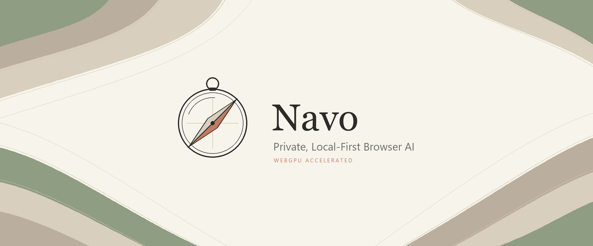
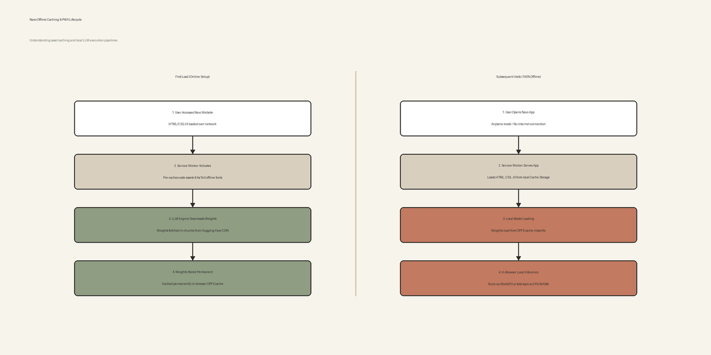
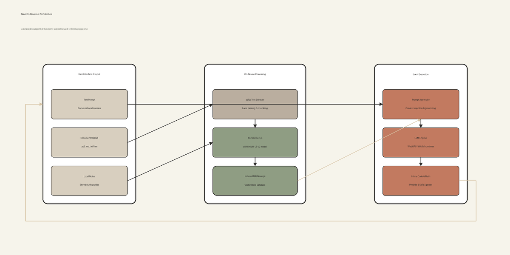
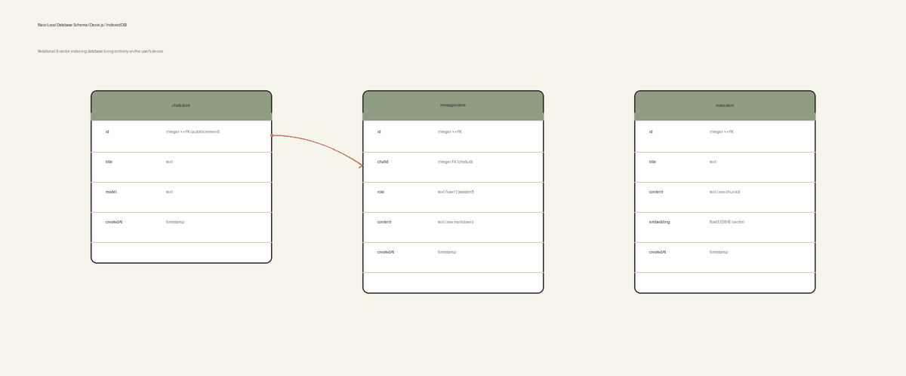

<div align="center">



<br/>

### *A Private, Local-First AI Assistant Operating 100% In Your Browser on Desktop & Mobile*

[](https://offline-companion-benedictpatrickjohn-9567s-projects.vercel.app)
[](LICENSE)
[](https://nextjs.org/)
[](https://www.typescriptlang.org/)
[](#features)

<p align="center">
  <a href="https://offline-companion-benedictpatrickjohn-9567s-projects.vercel.app"><b>Try it now →</b></a>
  •
  <a href="#getting-started"><b>Quick Start</b></a>
  •
  <a href="#system-architecture"><b>Architecture</b></a>
  •
  <a href="#compatibility-matrix"><b>Compatibility</b></a>
  •
  <a href="https://github.com/Benedictpatrick/Web-based-local-OfflineLLM/issues"><b>Report Issue</b></a>
</p>


</div>

---

## Overview

Navo is a private, client-side AI assistant designed to run fully within your browser on both desktop and mobile devices. There is no server, no external API keys, no analytics trackers, and no mandatory signups. 

The LLM engine, embedding generation, vector search database, document parser, code sandbox, and mathematical renderer all live on your local device. After the initial load, the service worker caches the assets and model files, allowing Navo to function completely offline without an internet connection.

> [!IMPORTANT]
> **100% Privacy Guarded:** Since there is no backend server transmitting logs, your chat history, documents, and notes never leave your computer. 

---

## Features

### WebGPU Accelerated & WASM Fallback Chat
Runs state-of-the-art small models (Llama 3.2 1B/3B, Gemma 2 2B) fully client-side.
- Uses **WebGPU** via [web-llm](https://github.com/mlc-ai/web-llm) for hardware-accelerated, near-native performance.
- Automatically falls back to **CPU/WebAssembly** via [wllama](https://github.com/ngxson/wllama) when WebGPU is unsupported or unavailable.
- Behind-the-scenes automatic model loading with progress indicators.

### Local Semantic Search & Knowledge Grounding
Store your lecture notes, code snippets, or reference guides locally.
- Integrated in-browser vector search database powered by **Dexie (IndexedDB)**.
- Real-time sentence embedding generation on note save using [transformers.js](https://github.com/huggingface/transformers.js) and the `all-MiniLM-L6-v2` model.
- Automatically retrieves semantically relevant notes based on your chat queries to ground the LLM's responses.

### Client-Side Document Conversational Agent
Attach `.txt`, `.md`, or `.pdf` files to extract text locally and chat with them.
- Fast PDF text extraction using [pdf.js](https://github.com/mozilla/pdf.js).
- Documents are split into semantic chunks, embedded dynamically, and retrieved when answering context-dependent questions.

### Inline Python Code Sandbox
Execute Python code generated by the LLM inside your browser.
- Interactive **"Run"** button embedded in generated code blocks.
- Execution happens within a secure browser sandbox powered by [Pyodide](https://pyodide.org) with zero network overhead.

### Offline Mathematical Rendering
Beautiful inline and block math formatting.
- Renders standard LaTeX equations instantly using [KaTeX](https://github.com/KaTeX/KaTeX).
- KaTeX stylesheets and web-fonts are fully pre-cached by the service worker to support 100% offline usage.

### Mobile-First & Installable PWA
Optimized for a responsive, touch-friendly interface across mobile, tablet, and desktop devices.
- **Install to Home Screen**: Installable as a Progressive Web App (PWA) on iOS and Android for a native-feeling standalone app window.
- **Offline Capabilities**: Service Worker caching allows you to load the app and run inferences on the go, even with cellular data turned off or in flight mode.
- **On-Device Storage Management**: Manage storage directly from your device by deleting cached LLM models from the model picker UI when needed.

#### Offline Caching & PWA Lifecycle



---

## System Architecture

Navo shifts the entire AI pipeline from the cloud to the client. The diagram below illustrates how user interactions, note saving, and files are managed on-device.



### Local Database Schema

Navo uses Dexie.js as a wrapper around the browser's IndexedDB to store user conversations, messages, and semantic notes along with vector embeddings:



---

## Compatibility Matrix

### Browser Support

| Browser | Platform | WebGPU Support | WASM Fallback | Recommendation |
| :--- | :--- | :---: | :---: | :--- |
| **Google Chrome** | Windows, macOS, Linux, Android | Supported | Supported | **Recommended** (Best Performance) |
| **Microsoft Edge** | Windows, macOS, Linux, Android | Supported | Supported | **Recommended** (Best Performance) |
| **Apple Safari** | macOS, iOS / iPadOS | Experimental | Supported | Good (Runs on WASM; enable WebGPU in settings) |
| **Mozilla Firefox** | Windows, macOS, Linux | Experimental | Supported | Good (Runs on WASM; enable WebGPU in config) |

### Model Options

| Model | Parameters | VRAM / RAM Req. | Caching Size | Provider | Purpose |
| :--- | :---: | :---: | :---: | :---: | :--- |
| **Llama 3.2 1B** | 1.24B | ~1.5 GB | ~1.2 GB | Meta | Fast definitions & quick analysis |
| **Llama 3.2 3B** | 3.21B | ~3.0 GB | ~2.5 GB | Meta | Advanced reasoning & coding tasks |
| **Gemma 2 2B** | 2.61B | ~2.2 GB | ~1.8 GB | Google | High-quality definitions & prose |
| **all-MiniLM-L6-v2** | 33M | ~120 MB | ~90 MB | HuggingFace | Local note/document embeddings |

### Typical Performance Benchmarks

Below are representative local inference performance speeds (Tokens/Second) across standard configurations:

| Device & Processor | Model Selected | Execution Backend | Speed (Tokens/sec) | System Performance |
| :--- | :---: | :---: | :---: | :--- |
| **Apple MacBook Pro (M2/M3 Max)** | Llama 3.2 3B | WebGPU | 25 – 35 t/s | Near-native speed |
| **Apple iPhone 15 Pro / 16 (A17/A18)** | Llama 3.2 1B | WebAssembly | 12 – 18 t/s | Smooth execution |
| **Google Pixel 8 / 9 (Tensor G3/G4)** | Gemma 2 2B | WebGPU | 15 – 22 t/s | Smooth execution |
| **Windows Desktop (RTX 4070)** | Llama 3.2 3B | WebGPU | 40 – 50 t/s | Near-instant generation |
| **Intel Core i7 (12th Gen Laptop)** | Llama 3.2 1B | WebGPU (Intel Xe) | 14 – 20 t/s | Smooth execution |
| **Generic Mid-Range Smartphone** | Llama 3.2 1B | WebAssembly (CPU) | 4 – 8 t/s | Functional speed |

---

## Getting Started

### Prerequisites
Make sure you have Node.js installed (v18.x or higher recommended).

### Setup and Installation

1. **Clone the repository:**
   ```bash
   git clone https://github.com/Benedictpatrick/Web-based-local-OfflineLLM.git
   cd Web-based-local-OfflineLLM
   ```

2. **Install dependencies:**
   ```bash
   npm install
   ```
   > [!NOTE]
   > The `predev` and `prebuild` scripts will automatically run scripts to sync local asset folders for KaTeX, PDF.js, and Pyodide so they are cached successfully.

3. **Start the development server:**
   ```bash
   npm run dev
   ```

4. **Access the application:**
   Open [http://localhost:3000](http://localhost:3000) in your WebGPU-enabled browser. 
   *(Note: The first time you load the chat, it needs an internet connection to download and cache the model. Subsequent loads will be entirely offline.)*

### Running Tests
Run the test suite powered by Vitest:
```bash
npm test
```

---

## Technology Stack

- **Framework**: [Next.js 15 (App Router)](https://nextjs.org/)
- **Language**: [TypeScript](https://www.typescriptlang.org/)
- **Styles**: [Tailwind CSS v4](https://tailwindcss.com/)
- **Database**: [Dexie.js](https://dexie.org/) (IndexedDB wrapper)
- **AI Core Engines**:
  - WebGPU LLM: [web-llm](https://github.com/mlc-ai/web-llm)
  - WASM Fallback: [wllama](https://github.com/ngxson/wllama)
  - Embedding Core: [@huggingface/transformers](https://github.com/huggingface/transformers.js)
- **Supporting Runtimes**:
  - Document Reader: [pdfjs-dist](https://github.com/mozilla/pdf.js)
  - Code Execution: [Pyodide](https://pyodide.org)
  - Formula rendering: [KaTeX](https://katex.org/)

---

## Roadmap

- [x] **WebGPU Acceleration** with CPU WASM fallback
- [x] **IndexedDB Local Storage** for user notes and chats
- [x] **Semantic Search** database for grounding context
- [x] **PDF Document Text Extraction** & in-browser RAG
- [x] **Inline Python Sandbox** powered by Pyodide
- [x] **PWA Support** for full offline installation
- [ ] **Multi-Document Upload** support (currently single file)
- [ ] **Chat Session Export** (JSON / Markdown formats)
- [ ] **Continuous Integration (CI)** automated testing workflow

---

## Troubleshooting & FAQ

#### Why is the initial load taking so long?
During the first load, the browser must fetch the model weights (e.g. 1.2 GB to 2.5 GB depending on the selected model) from the Hugging Face CDN. Once downloaded, the weights are stored permanently in your browser's local cache (OPFS or Cache Storage). Subsequent loads are instantaneous and happen completely offline.

#### Does running local models drain my mobile battery?
Yes. Processing LLMs client-side is highly resource-intensive. Using WebGPU is significantly more power-efficient than CPU/WebAssembly execution, but you will still experience higher battery consumption during active generation.

#### How can I free up browser storage space?
Navo provides an integrated model manager. You can delete downloaded models directly from the in-app model selection UI. Alternatively, you can clear the cache in your browser's site settings.

#### Why am I seeing a "WebGPU not supported" warning?
Your browser or hardware might not support WebGPU out of the box. Chrome and Edge support WebGPU by default. Firefox and Safari require enabling WebGPU in their developer settings. Navo automatically falls back to CPU/WebAssembly when WebGPU is not active.

---

## Contributing

Contributions make the open-source community an amazing place to learn, inspire, and create. Any contributions you make are **greatly appreciated**.

1. Fork the Project
2. Create your Feature Branch (`git checkout -b feature/AmazingFeature`)
3. Commit your Changes (`git commit -m 'Add some AmazingFeature'`)
4. Push to the Branch (`git push origin feature/AmazingFeature`)
5. Open a Pull Request

---

## License

Distributed under the MIT License. See [LICENSE](LICENSE) for more information.
